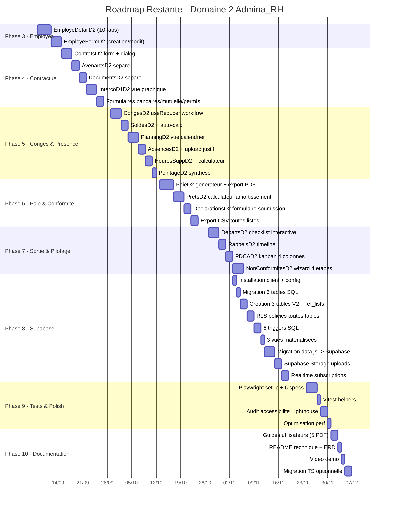

# Roadmap — Admina_RH Domaine 2

> Gestion Administrative du Personnel
> Application React déployée sur Cloudflare Pages
> URL : https://admina-rh-bd0.pages.dev/domaine2_Gestion_Administrative_Personnel
> Version document : 1.0 — Phase 0 — Task 3-c

---

## Sommaire

1. État Actuel (synthèse)
2. Phases Restantes à Exécuter
3. Diagramme de Gantt (Mermaid)
4. Tableau de Suivi
5. Risques et Dépendances
6. Critères de Validation par Phase
7. Estimation Charge & Ressources

---

## 1. État Actuel (synthèse)

Le Domaine 2 est déjà partiellement développé et déployé en production sur Cloudflare Pages. Voici la photographie au moment de cette roadmap.

| Phase | Statut | Détail |
|:------|:-------|:-------|
| **Phase 1** — Setup & Fondation | FAIT | Layout `D2Layout.jsx`, thème teal, 5 phases colorisées, composants réutilisables (`StatusBadge`, `KPICard`, `MontantCell`, `JoursRestantsCell`, `ProgressCell`, `EmptyState`, `SectionHeader`), mock data `data.js` (20 employés + 12 collections + 50 nomenclatures) |
| **Phase 2** — Tableau de Bord | FAIT | `TableauDeBordD2.jsx` complet : 4 KPI cards (Effectif, Contrats, Masse salariale, Taux présence), BarChart départements, PieChart types contrat, listes rappels urgents + congés en attente, 7 objectifs ISO, prêts en cours, bandeau conformité |
| **Phase 3-7** — Écrans métier | PARTIEL | 22 écrans squelette créés et déployés (DataTable MUI + filtres + badges statut). 16 écrans complets, 5 partiels (planning calendrier, générateur paie, calculateur prêts, checklist départ, détail employé), 1 non implémenté (détail employé). Manquent : formulaires création/modification détaillés, workflows interactifs `useReducer`, upload documents, export PDF |
| **Phase 8** — Tests | PARTIEL | Agent Browser basique (smoke test 22 routes + capture screenshot), pas de tests E2E Playwright, pas de tests unitaires vitest, pas d'audit accessibilité |
| **Phase 9** — Déploiement | FAIT | wrangler automatisé (`wrangler pages deploy dist`), `_redirects` SPA fallback, 81 fichiers déployés (deployment `937409c4`), URL production opérationnelle |

### 1.1 Répartition par phase fonctionnelle

| Phase fonctionnelle (D2) | Écrans concernés | Statut |
|:-------------------------|:-----------------|:-------|
| Phase 1 — Identification | Tableau de Bord, Fiche Employé | 1/2 FAIT (liste OK, détail non implémenté) |
| Phase 2 — Contractualisation | Contrats, Avenants, Documents, Bancaires, Mutuelle, Permis | 6/6 squelette (1 vide : Avenants) |
| Phase 3 — Présence & Congés | Congés, Soldes, Absences, HS, Pointage, Planning | 5/6 complets (Planning manque vue calendrier) |
| Phase 4 — Paie & Conformité | Paie, Déclarations, Prêts, Sanctions, Visites | 5/5 squelette (Paie + Prêts manquent interactifs) |
| Phase 5 — Sortie & Pilotage | Départs, Archivage, Rappels | 3/3 squelette (Départs manque checklist) |

### 1.2 Dette technique identifiée

| Dette | Impact | Phase de résolution |
|:------|:-------|:--------------------|
| Mock data en dur (`data.js` 38 KB) | Pas de persistance | Phase 8 |
| Pas de typage TypeScript | Risques runtime | Phase 10 (optionnel) |
| 18 écrans via `GenericD2Page` (config-driven) | Difficile à étendre | Phase 3-7 (éclatement progressif) |
| Validation formulaires manuelle | Erreurs saisie | Phase 3 (Zod optionnel) |
| Pas de tests automatisés | Régressions | Phase 9 |
| `aria-label` manquants sur IconButton | Accessibilité | Phase 9 |
| Variables `owner_role` / `validator_id` absentes | Pas de RLS fine | Phase 8 |

---

## 2. Phases Restantes à Exécuter

Les phases ci-dessous sont numérotées en continuité des phases 1-2 déjà faites. Elles couvrent le reste à faire pour atteindre la cible V2.

### Phase 3 — Approfondissement Employés (1 semaine)

**Objectif** : faire de la Fiche Employé la source unique de vérité navigable.

**Tâches** :

- Créer `EmployeDetailD2.jsx` — page détail avec 10 tabs :
  1. Informations personnelles (grille 2 colonnes readonly)
  2. Contrats (historique + avenants sous-table, statut auto)
  3. Documents (badges expiration 30j/15j, déclenche rappel si < 15j)
  4. Bancaire (RIB masqué, flag Compte Principal)
  5. Mutuelle (adhésion, couverture, personnes à charge)
  6. Congés (solde + historique + LineChart évolution 12 mois)
  7. Paie (historique 12 derniers mois)
  8. Sanctions (historique 4 niveaux)
  9. Visites médicales (historique + prochaine visite)
  10. Départs (si employé parti)
- Créer `EmployeFormD2.jsx` — dialog/stepper création/modification complet avec :
  - Validation champs obligatoires (matricule unique, email format, date cohérence)
  - Listes déroulantes branchées sur `NOMENCLATURES` (50 listes)
  - Auto-calc ancienneté (helper `calculerAnciennete`)
  - Upload photo employé (Supabase Storage Phase 8)
- Brancher boutons "Voir détail" / "Modifier" / "Nouvel Employé" de `EmployesD2.jsx`
- Ajouter route `employes/:id` dans `App.jsx`
- Export CSV de la liste (bouton déjà présent, à brancher)

**Livrables** :
- `src/pages/domaine2/EmployeDetailD2.jsx` (≈ 500 lignes)
- `src/pages/domaine2/EmployeFormD2.jsx` (≈ 300 lignes)
- Route `employes/:id` opérationnelle

**Critère de validation** :
- Navigation Liste → Détail → Modification → Retour Liste fonctionnelle sans erreur console.
- 10 tabs affichent les données mock de l'employé sélectionné.

---

### Phase 4 — Approfondissement Contractuel (1.5 semaines)

**Objectif** : finaliser la Phase 2 contractuelle avec formulaires complets.

**Tâches** :

- `ContratsD2.jsx` : ajouter dialog création/modification contrat complet
  - Type contrat (CDI/CDD/Stage/Interim/Apprentissage)
  - Date début + date fin (si CDD)
  - Auto-calc durée en mois + jours restants
  - Auto-bascule statut `echu` si jours restants < 0
  - Salaire brut FCFA + régime travail + lieu
  - Période essai (durée + date fin auto-calc)
- Créer `AvenantsD2.jsx` (séparer du `GenericD2Page`) :
  - Formulaire création avenant (5 types : Salaire, Poste, Temps partiel, Lieu travail, Promotion)
  - Traçabilité ancienne_valeur → nouvelle_valeur
  - Motif + date_effet + statut
  - Lien vers contrat parent
- Créer `DocumentsD2.jsx` (séparer du `GenericD2Page`) :
  - Upload document (Supabase Storage Phase 8) — placeholder bouton
  - Auto-calc jours restants + badge couleur
  - Trigger création rappel auto si < 15j (mock front, trigger SQL Phase 8)
- Brancher formulaire création/mutuelle/bancaires/permis
- Brancher boutons "Nouveau" sur les 6 écrans contractuels
- Implémenter écran 25 interconnexion D1-D2 (vue graphique 5 flux IC-D1-D2)

**Livrables** :
- `ContratsD2.jsx` mis à jour (+ formulaire dialog ≈ 200 lignes)
- `AvenantsD2.jsx` nouveau composant (≈ 250 lignes)
- `DocumentsD2.jsx` nouveau composant (≈ 250 lignes)
- `IntercoD1D2.jsx` vue graphique (≈ 200 lignes)
- Route `interco-d1` ajoutée

**Critère de validation** :
- Création avenant met à jour l'historique du contrat parent.
- Document avec date_expiration < 15j déclenche alerte visuelle.

---

### Phase 5 — Approfondissement Congés & Présence (1.5 semaines)

**Objectif** : workflows interactifs `useReducer` + vue calendrier.

**Tâches** :

- `CongesD2.jsx` : migrer workflow vers `useReducer`
  - États : `brouillon` → `en_attente` → `approuvee_n1` → `approuvee_n2` (si > 5j ou sans solde) → `rejetee` / `annulee`
  - Hook `useLeaveWorkflow(employeeId, leaveId)` centralisant transitions
  - Auto-calc `nombre_jours` (exclusion weekends + jours fériés via lib `date-fns` ou custom)
  - Mise à jour auto `d02_leave_balances` (mock front, trigger SQL Phase 8)
  - Boutons "Approuver niveau 1" (manager) / "Approuver niveau 2" (DRH) / "Rejeter"
- `SoldesD2.jsx` : séparer du `GenericD2Page`
  - Sélecteur d'année en haut (2023, 2024, 2025)
  - Auto-calc `solde_disponible = droit_annuel + report_n1 - conges_pris - conges_en_cours`
  - Auto-calc `taux_utilisation = (conges_pris / droit_annuel) * 100`
- Créer `PlanningD2.jsx` (séparer du `GenericD2Page`) :
  - Vue calendrier mensuel (grille 7j × 5sem) avec codes couleur (vert=présent, rouge=absent, orange=retard, bleu=congé, violet=mission)
  - Toggle Calendrier / Table
  - Génération auto depuis Pointage (mock front)
- `AbsencesD2.jsx` : workflow upload justificatif + validation manager + visite reprise auto si > 3 semaines
- `HeuresSuppD2.jsx` : workflow validation + auto-calc montant (`salaire_horaire_base = salaire_brut / 173.33`)
- `PointageD2.jsx` : synthèse taux présence moyen + validation hebdo manager

**Livrables** :
- 6 composants D2 phase 3 (≈ 250 lignes chacun)
- Hook `useLeaveWorkflow` (≈ 80 lignes)
- Hook `useOvertimeCalculator` (≈ 50 lignes)

**Critère de validation** :
- Demande congé > 5j déclenche 2e niveau validation DRH.
- Vue calendrier planning mensuel affiche couleurs cohérentes.
- Montant HS calculé correctement (test avec salaire 1 250 000 FCFA → taux 100% → 1h supp = 7 211 FCFA).

---

### Phase 6 — Approfondissement Paie & Conformité (1.5 semaines)

**Objectif** : générateur fiche paie + calculateur prêts.

**Tâches** :

- `PaieD2.jsx` (séparer du `GenericD2Page`) :
  - Bouton "Générer Fiche" (dialog multi-étapes)
  - Auto-récupération données : présence (pointage), congés sans solde, HS validées, prêts en cours
  - Calcul `salaire_brut = base + HS + primes - retenues_absences`
  - Calcul `cotisations = brut * taux_charges` (taux 25% par défaut)
  - Calcul `net_a_payer = brut - cotisations - deductions_prets`
  - Statuts : `generee` → `validee` (DRH) → `payee` (virement)
  - Export PDF via `html2canvas` + `jsPDF` (déjà dispo dans le sandbox D1)
  - Envoi par email (placeholder, mock front)
- `PretsD2.jsx` (séparer du `GenericD2Page`) :
  - Calculateur interactif : montant + taux + durée → mensualité
  - Formule amortissement constant : `M = (P × r/12) / (1 - (1+r/12)^-n)`
  - Cas taux 0% : `M = P / n`
  - Tableau d'amortissement (mois, mensualité, intérêts, capital, solde)
  - Workflow : `demande` → `accorde` (DRH) → `en_remboursement` → `solde`
  - Intégration paie (déduction mensuelle auto dans fiches paie)
- `DeclarationsD2.jsx` : étendre avec formulaire de soumission + alertes retard + import nombre salariés
- Brancher boutons "Générer" sur Paie, "Simuler" sur Prêts
- Brancher "Export CSV" sur tous les écrans (lib `papaparse`)

**Livrables** :
- `PaieD2.jsx` (≈ 400 lignes) + `PaySlipGenerator.jsx` (≈ 200 lignes)
- `PretsD2.jsx` (≈ 350 lignes) + `LoanCalculator.jsx` (≈ 150 lignes)
- Helper `paieCalculations.js` (≈ 100 lignes)
- Helper `loanAmortization.js` (≈ 60 lignes)

**Critère de validation** :
- Génération fiche paie produit un PDF téléchargeable.
- Calculateur prêts affiche tableau d'amortissement correct (vérifier formule avec exemple : P=1 000 000 FCFA, taux=12%, durée=12 mois → mensualité = 88 849 FCFA).

---

### Phase 7 — Approfondissement Sortie & Pilotage (1 semaine)

**Objectif** : checklist départ interactive + cycle PDCA.

**Tâches** :

- `DepartsD2.jsx` (séparer du `GenericD2Page`) :
  - Checklist interactive (checkboxes) avec 4 documents à remettre :
    - [ ] Attestation de travail
    - [ ] Certificat de travail
    - [ ] Reçu pour solde de tout compte
    - [ ] Attestation France Travail
  - Restitution matériel (badge, ordinateur, véhicule) — 3 checkboxes
  - Désactivation accès IT — toggle
  - Calcul automatique indemnité selon motif :
    - Démission : 0
    - Fin CDD : 10% prime précarité
    - Licenciement : formule légale (1/5 × salaire × années + 2/15 × années > 10)
    - Retraite : formule conventionnelle
  - Statut auto : `en_cours` → `en_attente_piece` → `clos`
- `RappelsD2.jsx` :
  - Timeline verticale triée par échéance
  - 5 types avec icônes distinctes
  - Bouton "Marquer comme traité" + champ action_requise
- Créer `PDCAD2.jsx` (écran 23 V2) :
  - Kanban 4 colonnes : PLAN | DO | CHECK | ACT
  - Drag & drop via `@hello-pangea/dnd` (déjà installé)
  - Cartes action : titre, responsable, dates, statut, KPI associé
- Créer `NonConformitesD2.jsx` (écran 24 V2) :
  - Wizard 4 étapes : Détection → Analyse (5 Pourquoi / Ishikawa) → Action corrective → Vérification
  - Registre DataTable + formulaire wizard

**Livrables** :
- `DepartsD2.jsx` (≈ 350 lignes) + `DepartureChecklist.jsx` (≈ 150 lignes)
- `RappelsD2.jsx` (≈ 250 lignes) + `TimelineReminders.jsx` (≈ 100 lignes)
- `PDCAD2.jsx` (≈ 300 lignes)
- `NonConformitesD2.jsx` (≈ 300 lignes) + `NCWizard.jsx` (≈ 200 lignes)
- Routes `pdca` et `non-conformites` ajoutées

**Critère de validation** :
- Cocher tous les éléments de checklist départ fait passer le statut à `clos`.
- Drag & drop PDCA persiste l'ordre des cartes (mock local storage).

---

### Phase 8 — Connexion Supabase (1.5 semaines)

**Objectif** : migration données mock → Supabase + RLS + triggers + realtime.

**Tâches** :

- Installer dépendances : `@supabase/supabase-js` (+ optionnel `@supabase/ssr`)
- Configurer variables d'environnement Cloudflare : `VITE_SUPABASE_URL`, `VITE_SUPABASE_ANON_KEY`
- Créer `supabaseClient.js` wrapper
- Exécuter migration SQL des 6 tables manquantes (`migration_6_tables_manquantes_D02.sql`)
- Créer 3 tables V2 : `d02_non_conformities`, `d02_pdca_actions`, `d02_audit_reports`
- Créer `ref_lists` (équivalent feuille `_Lists` Excel — 50 nomenclatures)
- Activer RLS sur toutes les tables (policies tenant_isolation)
- Créer 6 triggers SQL (cf. spec techniques §6.4)
- Créer 3 vues matérialisées (KPIs)
- Créer un hook `useSupabaseQuery` générique (SELECT with tenant_id filter)
- Migrer `data.js` vers appels Supabase :
  - `EMPLOYEES` → `supabase.from('employees').select('*').eq('tenant_id', tenantId)`
  - Pareil pour 17 autres collections
- Brancher Supabase Storage pour upload documents (justificatifs absences, documents employés, photos)
- Activer Realtime subscriptions sur `d02_reminders` + `d02_leave_requests` (rafraîchissement auto)
- Ajouter champs `owner_role`, `validator_id`, `validation_date` sur tables workflow
- Page `/parametres` D2 : afficher matrice RACI + gestion tenants (admin only)

**Livrables** :
- `src/pages/domaine2/supabaseClient.js` (≈ 30 lignes)
- `src/pages/domaine2/hooks/useSupabaseQuery.js` (≈ 80 lignes)
- 24 tables Supabase opérationnelles (RLS + indexes)
- 6 triggers SQL actifs
- 3 vues matérialisées
- Migration 100% des 18 collections `data.js` → Supabase

**Critère de validation** :
- Données mock supprimées de `data.js` (garde uniquement helpers + nomenclatures `NOMENCLATURES` qui peuvent rester en front pour rapidité UI).
- Insertion d'un employé côté front apparaît immédiatement dans la liste.
- Realtime : nouvelle demande de congé par employé A apparaît instantanément chez manager B sans refresh.

---

### Phase 9 — Tests E2E & Polish (1 semaine)

**Objectif** : tests automatisés + audit accessibilité + optimisation perf.

**Tâches** :

- Installer Playwright (`bun add -D @playwright/test`)
- Configurer `playwright.config.js` (baseURL : https://admina-rh-bd0.pages.dev/)
- Écrire scénarios E2E :
  - `employes.spec.js` : navigation liste → détail → modification
  - `conges.spec.js` : workflow 2 niveaux complet
  - `paie.spec.js` : génération fiche + export PDF
  - `departs.spec.js` : checklist interactive complète
  - `rappels.spec.js` : timeline + marquer traité
  - Smoke test 22 routes (parcours rapide)
- Installer `vitest` pour tests unitaires helpers (`paieCalculations`, `loanAmortization`, `formatFCFA`, `joursRestants`)
- Audit accessibilité via Lighthouse + `@axe-core/playwright`
  - Corriger `aria-label` manquants sur IconButton
  - Vérifier contrastes (teal #0D7C66 sur blanc : 4.97:1 OK)
  - Ajouter `<main>` / `<nav>` sémantiques
  - Tailles cibles tactile (44×44px min) — IconButton `size='small'` à revoir
- Optimisation performance :
  - Code splitting plus fin (lazy load sur dialog formulaires)
  - `React.memo` sur cellules tableau
  - Préchargement routes (`<Link rel="preload">`)
  - Mesurer Lighthouse LCP < 2.5s, CLS < 0.1
- Brancher Sentry / monitoring erreur (optionnel)

**Livrables** :
- `playwright.config.js`
- 6 fichiers `*.spec.js` (≈ 100 lignes chacun)
- `vitest.config.js` + 5 fichiers `*.test.js`
- Rapport Lighthouse (avant/après)
- Score accessibilité AA atteint

**Critère de validation** :
- 100% des scénarios Playwright passent en CI.
- Couverture helpers `data.js` > 80%.
- Lighthouse Performance > 90, Accessibility > 95.

---

### Phase 10 — Documentation Finales (0.5 semaine)

**Objectif** : documentation utilisateur + technique + migration optionnelle TypeScript.

**Tâches** :

- Documentation utilisateur :
  - Guide employé (consulte fiche, demande congé, justificatif absence)
  - Guide manager (validation congés, HS, pointage)
  - Guide DRH (validation finale, sanctions, départs)
  - Guide comptable (paie, déclarations, prêts)
  - Guide assistant RH (saisie quotidienne, rappels)
- Documentation technique :
  - README D2 (installation, build, deploy)
  - Schéma BDD complet (PDF ER diagram)
  - Documentation API Supabase (Edge Functions si besoin)
  - Documentation composants réutilisables
- Vidéo de démonstration (parcours principal)
- Migration TypeScript optionnelle :
  - Si validé : renommer `.jsx` → `.tsx` progressivement (D2Layout, components, data)
  - Créer `types/domaine2.ts` (interfaces pour employees, contracts, etc.)
  - Strict mode activé dans `tsconfig.json`
- Recette finale avec utilisateur

**Livrables** :
- 5 guides utilisateur PDF (via skill pdf)
- `README_D2.md`
- Schéma ERD D2
- Vidéo démo (5 min)
- (Optionnel) Migration TS partielle

**Critère de validation** :
- Recette utilisateur sans blocker.
- Documentation indexée et accessible.

---

## 3. Diagramme de Gantt (Mermaid)

### 3.1 Durées résumées

| Phase | Durée estimée | Début | Fin |
|:------|:--------------|:------|:----|
| Phase 3 | 1 semaine | 08/09/2025 | 14/09/2025 |
| Phase 4 | 1.5 semaines | 15/09/2025 | 26/09/2025 |
| Phase 5 | 1.5 semaines | 29/09/2025 | 10/10/2025 |
| Phase 6 | 1.5 semaines | 13/10/2025 | 24/10/2025 |
| Phase 7 | 1 semaine | 27/10/2025 | 04/11/2025 |
| Phase 8 | 1.5 semaines | 03/11/2025 | 21/11/2025 |
| Phase 9 | 1 semaine | 24/11/2025 | 28/11/2025 |
| Phase 10 | 0.5 semaine | 01/12/2025 | 05/12/2025 |
| **TOTAL** | **9.5 semaines** | **08/09/2025** | **05/12/2025** |

> Note : Phases 7 et 8 se chevauchent intentionnellement (le front Phase 7 peut avancer pendant que le back Supabase Phase 8 démarre).

---

## 4. Tableau de Suivi

| Phase | Statut | Début prévu | Fin prévue | Dépendances | Composants livrés |
|:------|:-------|:------------|:-----------|:------------|:------------------|
| Phase 1 — Setup | FAIT | — | — | — | D2Layout, theme, components, data.js |
| Phase 2 — Dashboard | FAIT | — | — | Phase 1 | TableauDeBordD2 |
| Phase 3 — Employés | À FAIRE | 08/09/2025 | 14/09/2025 | Phase 2 | EmployeDetailD2, EmployeFormD2 |
| Phase 4 — Contractuel | À FAIRE | 15/09/2025 | 26/09/2025 | Phase 3 (détail employé) | ContratsD2 update, AvenantsD2, DocumentsD2, IntercoD1D2 |
| Phase 5 — Congés & Présence | À FAIRE | 29/09/2025 | 10/10/2025 | Phase 4 | CongesD2 update, SoldesD2, PlanningD2, AbsencesD2, HeuresSuppD2, PointageD2 |
| Phase 6 — Paie & Conformité | À FAIRE | 13/10/2025 | 24/10/2025 | Phase 5 (HS validées alimentent paie) | PaieD2, PretsD2, DeclarationsD2 update, exports CSV |
| Phase 7 — Sortie & Pilotage | À FAIRE | 27/10/2025 | 04/11/2025 | Phase 6 (paie pour solde tout compte) | DepartsD2, RappelsD2, PDCAD2, NonConformitesD2 |
| Phase 8 — Supabase | À FAIRE | 03/11/2025 | 21/11/2025 | Toutes phases front (mocks à remplacer) | supabaseClient, hooks, migration 24 tables |
| Phase 9 — Tests & Polish | À FAIRE | 24/11/2025 | 28/11/2025 | Phase 8 (tests sur données réelles) | Playwright specs, vitest, audit Lighthouse |
| Phase 10 — Documentation | À FAIRE | 01/12/2025 | 05/12/2025 | Phase 9 (recette avant doc) | 5 guides PDF, README, ERD, vidéo |

### 4.1 Jalons clés

| Jalon | Date cible | Critère |
|:------|:-----------|:--------|
| M1 — Détailler Employé OK | 14/09/2025 | Détail employé 10 tabs navigable |
| M2 — Contractuel complet | 26/09/2025 | Formulaires création sur tous écrans contractuels |
| M3 — Congés workflow complet | 10/10/2025 | Demande congé → validation 2 niveaux → maj solde |
| M4 — Paie + PDF | 24/10/2025 | Génération fiche paie avec export PDF |
| M5 — Sortie + PDCA | 04/11/2025 | Checklist départ + kanban PDCA opérationnels |
| M6 — Supabase live | 21/11/2025 | Données persistées, RLS active, realtime opérationnel |
| M7 — Tests E2E verts | 28/11/2025 | 100% specs Playwright passent |
| M8 — Recette finale | 05/12/2025 | Documentation livrée, recette utilisateur sans blocker |

---

## 5. Risques et Dépendances

### 5.1 Risques identifiés

| Risque | Probabilité | Impact | Mitigation |
|:-------|:------------|:-------|:-----------|
| Credentials Supabase non disponibles | Moyenne | BLOQUANT Phase 8 | Demander accès projet `aywwakllgvfoqlpowzqf` dès Phase 5 |
| Migration TypeScript optionnelle | Faible | Moyen | Reporter Phase 10 ou post-livraison si planning serré |
| Performance Supabase (latence) | Faible | Moyen | Vues matérialisées + cache TanStack Query |
| Refactor `GenericD2Page` → composants dédiés | Moyenne | Moyen | Phase 3-7 progressive (un par phase, pas tout d'un coup) |
| Workflows `useReducer` complexes | Moyenne | Faible | Hook `useLeaveWorkflow` isolé et testable |
| Upload justificatifs (Supabase Storage) | Faible | Moyen | Polices RLS Storage + signed URLs (24h) |
| Tests E2E sur données Supabase | Moyenne | Moyen | Compte test dédié + seed fixtures |
| Accessibilité WCAG AA complète | Moyenne | Faible | Audit Lighthouse Phase 9, corrections itératives |
| Régression D1 lors ajout routes D2 | Faible | Élevé | Détection conditionnelle `isD2` déjà en place, tests smoke D1 |
| Token Cloudflare expiré en cours de route | Faible | BLOQUANT déploiement | Renouvellement PAT via dashboard Cloudflare |

### 5.2 Dépendances externes

| Dépendance | Fournisseur | Statut |
|:-----------|:-----------|:-------|
| Accès projet Supabase `aywwakllgvfoqlpowzqf` | Utilisateur | À valider |
| Token Cloudflare API (`CLOUDFLARE_API_TOKEN`) | Utilisateur | Disponible (Task 2 worklog) |
| Account ID Cloudflare (`CLOUDFLARE_ACCOUNT_ID`) | Utilisateur | Disponible |
| Fichier Excel source (23 feuilles) | Repo audit | Disponible |
| PDF Interconnexion D1-D2 | Repo audit | Disponible |
| Migration SQL 6 tables | Repo audit | Disponible |
| Spec V2 (1669 lignes) | Repo audit | Disponible |

### 5.3 Dépendances techniques

| Dépendance | Version requise | Disponibilité |
|:-----------|:----------------|:--------------|
| `@supabase/supabase-js` | ^2.x | À installer Phase 8 |
| `@playwright/test` | ^1.40+ | À installer Phase 9 |
| `vitest` | ^2.x | À installer Phase 9 |
| `html2canvas` | ^1.4+ | À vérifier (présent dans sandbox D1 ?) |
| `jsPDF` | ^2.5+ | À installer Phase 6 |
| `papaparse` | ^5.4+ | À installer Phase 6 |
| `date-fns` | ^3.x | À installer Phase 5 (calcul jours congés) |
| `@axe-core/playwright` | ^4.8+ | À installer Phase 9 |
| `@supabase/ssr` | ^0.5+ | Optionnel Phase 8 |

---

## 6. Critères de Validation par Phase

### Phase 3 — Validé si :

- [ ] Page `/domaine2_.../employes/:id` accessible
- [ ] 10 tabs affichent données mockées employé
- [ ] Formulaire création employé valide matricule unique
- [ ] Bouton "Voir détail" navigation liste → détail
- [ ] Bouton "Modifier" pré-remplit le formulaire
- [ ] Export CSV télécharge un fichier `.csv`

### Phase 4 — Validé si :

- [ ] Création contrat calcule auto durée + jours restants
- [ ] Création avenant met à jour contrat parent
- [ ] Upload document (placeholder) en place
- [ ] Alerte auto si document expire < 15j
- [ ] Vue graphique 5 flux IC-D1-D2 rendue

### Phase 5 — Validé si :

- [ ] Demande congé > 5j nécessite validation niveau 2 (DRH)
- [ ] Auto-calc nombre_jours exclut weekends
- [ ] Solde congés mis à jour après approbation
- [ ] Vue calendrier planning mensuel affiche codes couleur
- [ ] Montant HS calculé correctement (vérifier formule)

### Phase 6 — Validé si :

- [ ] Génération fiche paie produit PDF téléchargeable
- [ ] Calculateur prêts affiche tableau amortissement correct
- [ ] Export CSV opérationnel sur tous écrans

### Phase 7 — Validé si :

- [ ] Checklist départ coche/décoche fonctionne
- [ ] Calcul indemnité correct selon motif
- [ ] Statut dossier auto-bascule `en_cours` → `clos`
- [ ] Drag & drop PDCA persistant (localStorage)
- [ ] Wizard 4 étapes NC navigable

### Phase 8 — Validé si :

- [ ] Données persistées en Supabase (mock supprimé de `data.js`)
- [ ] RLS active — utilisateur tenant A ne voit pas tenant B
- [ ] 6 triggers SQL opérationnels (test insertion données)
- [ ] Realtime — nouveau rappel apparaît sans refresh
- [ ] Upload document fonctionne (Supabase Storage)

### Phase 9 — Validé si :

- [ ] 6 specs Playwright passent en CI
- [ ] Couverture helpers `data.js` > 80%
- [ ] Lighthouse Performance > 90
- [ ] Lighthouse Accessibility > 95
- [ ] Aucune erreur critique console

### Phase 10 — Validé si :

- [ ] 5 guides utilisateur PDF livrés
- [ ] README D2 complet
- [ ] Schéma ERD généré
- [ ] Vidéo démo 5 min
- [ ] Recette utilisateur sans blocker

---

## 7. Estimation Charge & Ressources

### 7.1 Charge estimée par phase (en jours-homme)

| Phase | Jours-homme | Composants principaux |
|:------|:------------|:----------------------|
| Phase 3 | 5 j | 2 composants + 1 route |
| Phase 4 | 7.5 j | 4 composants + 1 route + 6 formulaires |
| Phase 5 | 7.5 j | 6 composants + 2 hooks |
| Phase 6 | 7.5 j | 2 composants + 2 helpers + 4 formulaires |
| Phase 7 | 5 j | 4 composants + 1 wizard |
| Phase 8 | 7.5 j | SQL + RLS + triggers + client + migration |
| Phase 9 | 5 j | Playwright + vitest + audit + perf |
| Phase 10 | 2.5 j | Documentation + optionnel TS |
| **TOTAL** | **47.5 j-homme** | ≈ 9.5 semaines à temps plein |

### 7.2 Ressources nécessaires

| Rôle | Allocation | Phases concernées |
|:-----|:-----------|:------------------|
| Développeur front React/MUI | 100% | Toutes phases |
| Architecte Supabase / SQL | 50% | Phase 8 principalement |
| Designer UX (optionnel) | 25% | Phases 3-7 (écrans détail) |
| Testeur QA | 50% | Phase 9 |
| Rédacteur technique | 25% | Phase 10 |
| Product owner (utilisateur métier RH) | 10% | Recettes fin de phase + Phase 10 |

### 7.3 Critères de go/no-go par phase

Chaque phase doit remplir ces conditions pour passer à la suivante :

1. Critères de validation (cf. section 6) remplis à 100%.
2. Build Vite réussi sans erreur.
3. Déploiement Cloudflare Pages OK (wrangler sans erreur).
4. Smoke test Agent Browser OK (22 routes accessibles, pas d'erreur console).
5. Commit / push sur branche `feature/phase-X` (si Git).

---

## 8. Notes & Décisions

### 8.1 Décisions assumées

- **Stack conservée** : React 19 + Vite 8 + MUI 9 + JSX. Pas de migration vers Next.js + shadcn (cf. spec techniques §10.1).
- **TypeScript optionnel** : reporté en Phase 10, sera décidé selon le temps restant.
- **18 écrans via `GenericD2Page`** : éclatement progressif (un composant dédié par écran) lors des phases 4-7. Pas de refactor big-bang.
- **Mock data conservé en parallèle de Supabase** : pendant la phase 8, les deux sources coexistent (feature flag `USE_SUPABASE`) pour permettre rollback.
- **Tests E2E après Supabase** : choix de tester sur données réelles plutôt que mocks (Phase 9 après Phase 8).
- **Documentation en français** : cohérent avec l'app (FR only).

### 8.2 Questions ouvertes (à valider avec l'utilisateur)

1. **Migration TypeScript** : priorité ? Ou conservé en JSX pur pour matcher Domaine 1 ?
2. **Supabase project** : utiliser le projet existant `aywwakllgvfoqlpowzqf` ou en créer un nouveau dédié Domaine 2 ?
3. **Auth Supabase** : utiliser Supabase Auth natif ou solution existante (à déterminer) ?
4. **Multi-tenant en production** : combien de tenants attendus ? (= impact performance RLS)
5. **PWA / offline** : besoin d'usage mobile hors ligne (pointage terrain) ?
6. **Internationalisation** : FR uniquement ou prévoir EN/AR (Afrique du Nord) ?
7. **Audits ISO réels** : doit-on tracer dans `d02_audit_reports` dès maintenant (Phase 8) ou post-livraison ?
8. **Workflow email notifications** : envoyer emails réels (SendGrid/Resend) ou notifications in-app uniquement ?

---

*Document généré le 02/09/2025 — Phase 0 — Task 3-c.*
*Spécifications techniques associées : `/home/z/my-project/work-admina/docs/phase0/specifications_techniques.md`*
