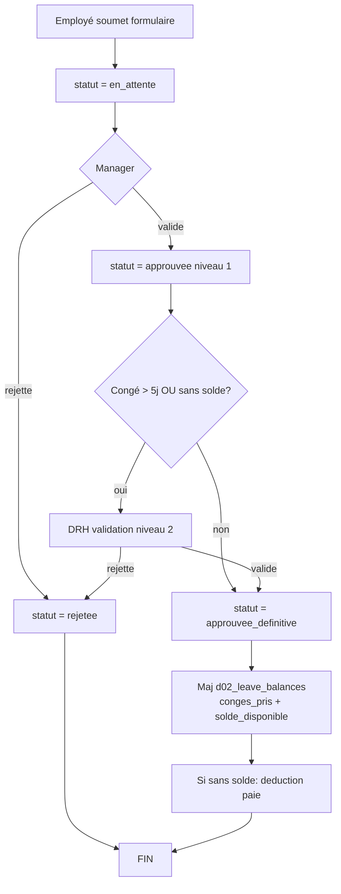
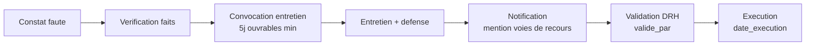

# Spécifications Techniques — Admina_RH Domaine 2

> Gestion Administrative du Personnel — Application React déployée sur Cloudflare Pages
> URL cible : https://admina-rh-bd0.pages.dev/domaine2_Gestion_Administrative_Personnel
> Référentiel normatif : ISO 30401:2018 + ISO 9001:2015
> Version document : 1.0 — Phase 0

---

## Sommaire

1. Stack Technique (RÉELLE)
2. Architecture Actuelle (déployée)
3. Composants Réutilisables (déjà créés)
4. Design System
5. Écrans (22)
6. Cible Supabase (à connecter)
7. Workflows Techniques (front-end)
8. Interconnexions Front-End
9. Déploiement
10. Écarts vs Spécification V2
11. Contraintes & Conformité

---

## 1. Stack Technique (RÉELLE)

> Important : La stack réellement déployée diffère de la spec V2 (Next.js + shadcn). L'application Domaine 2 vit dans le monorepo Vite existant du Domaine 1, dans un sous-répertoire `src/pages/domaine2/`. Aucune migration TypeScript n'a été faite — tout est en JSX.

### 1.1 Dépendances production

| Catégorie | Technologie | Version réelle | Statut |
|:----------|:------------|:---------------|:-------|
| Framework UI | React | 19.2.8 | OK |
| React DOM | react-dom | 19.2.8 | OK |
| Build tooling | Vite | 8.2.2 | OK |
| Plugin React | @vitejs/plugin-react | 6.1.0 | OK |
| Composants UI | @mui/material | 9.4.0 | OK |
| Icônes MUI | @mui/icons-material | 9.4.0 | OK |
| Styling moteur | @emotion/react | 11.14.0 | OK |
| Styling styled | @emotion/styled | 11.14.1 | OK |
| Routing | react-router-dom | 7.18.3 | OK |
| Charts | recharts | 3.10.1 | OK |
| Drag & drop | @hello-pangea/dnd | 18.0.1 | OK (D1, dispo pour D2) |
| Grid layout | react-grid-layout | 2.2.4 | OK (dispo) |

### 1.2 Dépendances dev

| Outil | Version | Usage |
|:------|:--------|:------|
| vite | 8.2.2 | Dev server + build |
| @vitejs/plugin-react | 6.1.0 | JSX Fast Refresh |
| oxlint | 1.79.0 | Linting (alternative ESLint) |
| wrangler | 4.128.0 | Déploiement Cloudflare Pages |
| @types/react | 19.2.18 | Types pour IDE (JSX non typé) |
| @types/react-dom | 19.2.4 | Types pour IDE |

### 1.3 Stack NON utilisée (vs spec V2)

| Technologie V2 | Statut réel | Raison |
|:---------------|:------------|:-------|
| Next.js 15 (App Router) | NON | Vite 8 utilisé à la place |
| TypeScript | NON | JSX pur (pas de typage) |
| Tailwind CSS 4 | NON | MUI 9 + Emotion |
| shadcn/ui | NON | Composants MUI sur mesure |
| Cloudflare Workers | NON | Cloudflare Pages (static + SPA) |
| Supabase JS client | NON installé | Mock data JS en attendant |
| @supabase/ssr | NON installé | Sera ajouté Phase 8 |
| Prisma | NON | Pas de besoins ORM (Supabase direct) |
| Playwright | NON installé | Prévu Phase 9 |
| vitest / jest | NON | Pas de tests unitaires actuellement |
| Zod | NON | Validation à la main (useState) |

### 1.4 Scripts disponibles

```json
{
  "dev": "vite",
  "build": "vite build",
  "lint": "oxlint",
  "preview": "vite preview"
}
```

Le déploiement Cloudflare est réalisé via `wrangler pages deploy dist` (script ad-hoc, hors package.json) avec `CLOUDFLARE_API_TOKEN` + `CLOUDFLARE_ACCOUNT_ID` en variables d'environnement.

---

## 2. Architecture Actuelle (déployée)

### 2.1 Arborescence réelle de `src/`

```
app/
├── index.html
├── package.json
├── vite.config.js
├── bun.lock
├── public/
│   ├── _redirects              # SPA fallback Cloudflare
│   ├── favicon.svg
│   └── icons.svg
└── src/
    ├── main.jsx                # Entry point Vite
    ├── App.jsx                 # Routing racine BrowserRouter
    ├── theme.js                # lightTheme + darkTheme (teal #0D7C66)
    ├── assets/
    │   ├── react.svg
    │   ├── vite.svg
    │   └── hero.png
    ├── components/             # Composants Domaine 1 (Sidebar, Header, KPICard, AddDialog)
    ├── context/
    │   ├── AppContext.jsx      # Dark mode + sidebar state
    │   ├── RoleContext.jsx     # Rôle utilisateur (admin, rh, manager)
    │   └── DashboardFilterContext.jsx
    ├── data/
    │   └── nomenclatures.js    # Listes D1
    └── pages/
        ├── TableauDeBord.jsx   # Dashboard D1
        ├── Offres.jsx
        ├── ... (32 pages D1)
        └── domaine2/           # === MODULE DOMAIN 2 ===
            ├── D2Layout.jsx            # Layout sidebar 5 phases + header
            ├── TableauDeBordD2.jsx     # Écran 1 — Dashboard D2
            ├── EmployesD2.jsx          # Écran 2 — Liste employés
            ├── ContratsD2.jsx          # Écran 4 — Contrats travail
            ├── CongesD2.jsx            # Écran 10 — Congés + dialog
            ├── GenericD2Page.jsx       # Écrans 5-22 (générique config-driven)
            ├── components.jsx          # StatusBadge, KPICard, MontantCell, etc.
            └── data.js                 # Mock data + nomenclatures + helpers
```

### 2.2 Routing

- `BrowserRouter` racine dans `App.jsx` (`<BrowserRouter><AppContent /></BrowserRouter>`).
- Détection conditionnelle : `const isD2 = loc.pathname.startsWith('/domaine2_Gestion_Administrative_Personnel')`.
- Si `isD2` : rendu d'un sous-arbre de routes `<Routes>` dédié avec `D2Layout` comme layout parent (`<Route path={D2_BASE} element={<D2Layout />}>`). Le layout D1 (Sidebar + Header) est complètement masqué.
- 22 routes déclarées en `lazy(() => import(...))` pour découpage de chunks.
- `Suspense` avec fallback minimal `<Box p={3}>Chargement Domaine 2...</Box>`.

```jsx
// Extrait App.jsx — branches D2
const D2_BASE = '/domaine2_Gestion_Administrative_Personnel';
if (isD2) {
  return (
    <ThemeProvider theme={theme}>
      <CssBaseline />
      <AppProvider darkMode={darkMode} toggleDark={toggleDark}>
        <RoleProvider>
          <Suspense fallback={<Box p={3}>Chargement Domaine 2...</Box>}>
            <Routes>
              <Route path={D2_BASE} element={<D2Layout darkMode={darkMode} toggleDark={toggleDark} />}>
                <Route index element={<TableauDeBordD2 />} />
                <Route path='employes' element={<EmployesD2 />} />
                <Route path='contrats' element={<ContratsD2 />} />
                <Route path='conges' element={<CongesD2 />} />
                <Route path='avenants' element={<GenericD2Page screen='avenants' />} />
                {/* ... 17 autres routes via GenericD2Page ... */}
              </Route>
            </Routes>
          </Suspense>
        </RoleProvider>
      </AppProvider>
    </ThemeProvider>
  );
}
```

### 2.3 Lazy loading & chunks build

Sortie build Vite observée (cf. worklog Task 2) :

| Chunk | Taille approx. | Rôle |
|:------|:---------------|:-----|
| `index-[hash].js` | ~80 KB | Entry + App + router |
| `D2Layout-[hash].js` | 18 KB | Layout sidebar 5 phases |
| `TableauDeBordD2-[hash].js` | 10 KB | Dashboard D2 |
| `GenericD2Page-[hash].js` | 20 KB | 18 écrans config-driven |
| `CongesD2-[hash].js` | 8 KB | Congés + dialog demande |
| `components-[hash].js` | 36 KB | StatusBadge, KPICard, etc. (D2) |

Total : 86 fichiers produits dans `dist/`, 81 uploadés sur Cloudflare Pages.

### 2.4 Gestion des données

#### État actuel — Mock data JS

- Toutes les données sont stockées dans `src/pages/domaine2/data.js` (~38 KB).
- Export nommé : `EMPLOYEES`, `CONTRACTS`, `CONGES`, `SOLDES_CONGES`, `DOCUMENTS`, `RAPPELS`, `HEURES_SUPP`, `DECLARATIONS`, `SANCTIONS`, `VISITES_MEDICALES`, `PRETS`, `DEPARTS`, `NOMENCLATURES`, `LABELS`.
- Helpers : `formatFCFA`, `formatDate`, `joursRestants`, `calculerAnciennete`, `employeeFullName`, `findEmployee`, `computeKPIs`.
- Volume : 20 employés mockés basés sur l'échantillon Excel (Nganou Clarisse EMP-001, Atangana Joseph EMP-002, etc.).
- Nomenclatures : 50 listes extraites de la feuille `_Lists` de l'Excel de référence (civilité, type contrat, département, banque, type document, etc.).

#### Cible — Supabase multi-tenant

À connecter en Phase 8 (cf. section 6). Le schema `data.js` est conçu pour être transposable tel quel vers `d02_*` tables.

---

## 3. Composants Réutilisables (déjà créés)

Tous les composants D2 sont centralisés dans `src/pages/domaine2/components.jsx` (122 lignes).

### 3.1 Catalogue

| Composant | Signature | Usage | Statut |
|:----------|:----------|:------|:-------|
| `StatusBadge` | `({ status, label?, size? })` | Chip coloré mappant statut → couleur MUI (success/warning/error/info/default) | OK |
| `KPICard` | `({ label, value, icon, color?, trend?, subtitle?, target? })` | Card KPI avec icône + valeur + tendance % + cible tooltip | OK |
| `MontantCell` | `({ value, align? })` | Cellule tableau format `1 250 000 FCFA` (Intl.NumberFormat fr-FR) | OK |
| `JoursRestantsCell` | `({ date })` | Chip coloré selon échéance (< 15j=error, < 30j=warning, sinon success, "Expiré" si < 0) | OK |
| `ProgressCell` | `({ value, max?, color?, label? })` | LinearProgress MUI + % à droite | OK |
| `EmptyState` | `({ icon, title, action? })` | Placeholder liste vide | OK |
| `SectionHeader` | `({ title, subtitle?, action? })` | En-tête de section avec bouton action à droite | OK |

### 3.2 Mapping statuts → couleurs (extrait)

```js
const STATUT_COLORS = {
  // Employés
  'Actif': 'success', 'Inactif': 'default', 'Suspendu': 'error', 'Essai': 'warning',
  // Contrats
  'En vigueur': 'success', 'Echu': 'default', 'Resilie': 'error', 'Suspendu': 'warning',
  // Congés
  'en_attente': 'warning', 'approuvee': 'success', 'rejetee': 'error', 'annulee': 'default',
  // Documents
  'Valide': 'success', 'A renouveler': 'warning', 'Expire': 'error',
  // Déclarations
  'soumise': 'info', 'en_retard': 'error', 'validee': 'success',
  // Prêts
  'demande': 'default', 'accorde': 'info', 'en_remboursement': 'warning',
  'solde': 'success', 'refuse': 'error',
  // Sanctions (gradient sévérité)
  'avertissement_oral': 'warning', 'avertissement_ecrit': 'warning',
  'blame': 'error', 'suspension': 'error',
  // Aptitude médicale
  'apte': 'success', 'apte_avec_restrictions': 'warning',
  'inapte_temporaire': 'error', 'inapte_definitif': 'error',
  // Départs
  'en_cours': 'info', 'en_attente_piece': 'warning', 'clos': 'success',
};
```

### 3.3 Layout dédié — `D2Layout.jsx`

Le layout D2 est un composant autonome (ne réutilise pas `Sidebar` / `Header` de D1) :

- `Drawer` permanent largeur 270 px, `bgcolor: '#1a1a2e'` (dark navy).
- Header `AppBar` largeur `calc(100% - 270px)`, hauteur 80 px.
- 5 sections de navigation colorées (cf. §4 Design System) totalisant 22 items.
- Breadcrumbs dynamiques : Admina-RH / Domaine 2 / {Titre écran}.
- Barre de recherche InputBase (placeholder : "Rechercher employé, contrat...").
- Toggle dark mode (`DarkModeIcon` / `LightModeIcon`).
- Menu notifications (badge `badgeContent={3}`) avec 3 alertes mockées (passeport expiré, déclaration en retard, 2 demandes de congés en attente).
- Avatar + libellé "Directeur RH / Administrateur".
- Footer sidebar : "ISO 30401:2018 · ISO 9001:2015".
- Bouton retour Domaine 1 (`navigate('/')`).

### 3.4 Composants non créés (à ajouter Phase 3+)

| Composant manquant | Usage prévu |
|:-------------------|:------------|
| `DetailTabs` | Onglets employé détail (10 tabs) |
| `EmployeeForm` | Formulaire création/modification employé |
| `ContractForm` | Formulaire contrat + avenant |
| `LeaveRequestDialog` | Étendu : workflow 2 niveaux |
| `PaySlipGenerator` | Générateur fiche de paie + export PDF |
| `LoanCalculator` | Simulateur mensualité + tableau amortissement |
| `DepartureChecklist` | Checklist interactive départ |
| `CalendarView` | Vue calendrier planning mensuel |
| `TimelineReminders` | Timeline verticale rappels |
| `PDCAKanban` | Kanban 4 colonnes PLAN/DO/CHECK/ACT |

---

## 4. Design System

### 4.1 Thème MUI — `src/theme.js`

Deux thèmes (light/dark) via `createTheme` de `@mui/material/styles`. Toggle persistant via `localStorage.getItem('admina-dark')`.

```js
// lightTheme
palette.primary.main    = '#0D7C66'  // teal Admina_RH
palette.primary.light    = '#0ea685'
palette.primary.dark     = '#095e4d'
palette.secondary.main   = '#1a1a2e'  // navy sidebar
palette.background.default = '#f5f6fa'
palette.background.paper   = '#ffffff'
typography.fontFamily   = '"Inter", "Roboto", "Helvetica", "Arial", sans-serif'
components.MuiButton    textTransform: 'none', borderRadius: 8
components.MuiPaper     borderRadius: 12
components.MuiTableCell fontSize: '0.82rem'
```

```js
// darkTheme
palette.primary.main   = '#0ea685'
palette.background.default = '#0a0a1a'
palette.background.paper   = '#141428'
palette.text.primary = '#e8e8e8'
```

### 4.2 Couleurs des 5 phases (sidebar D2)

| Phase | Couleur hex | Signification |
|:------|:------------|:--------------|
| Phase 1 — Identification | `#1B4F72` | Bleu marine — Fiche Employé (source unique) |
| Phase 2 — Contractualisation | `#2E86C1` | Bleu clair — Contrats, documents, banque, mutuelle, permis |
| Phase 3 — Présence & Congés | `#27AE60` | Vert — Congés, soldes, absences, HS, pointage, planning |
| Phase 4 — Paie & Conformité | `#F39C12` | Orange — Paie, déclarations, prêts, sanctions, visites |
| Phase 5 — Sortie & Pilotage | `#8E44AD` | Violet — Départs, archivage, rappels |

### 4.3 Typographie

- Police : **Inter** (avec fallback Roboto, Helvetica, Arial).
- Tailles de référence :
  - Headers écrans : `1.1rem` / fontWeight 700
  - Titres sections : `0.95rem` / 700
  - Cellules tableau : `0.82rem` (override MuiTableCell)
  - Badges / chips : `0.68rem` / 600
  - Caption breadcrumb : `0.72rem`

### 4.4 Patterns UX en place

| Pattern | Implémentation actuelle |
|:--------|:------------------------|
| List + detail | DataTable + bouton "Voir détail" (lien route à brancher en Phase 3) |
| Filtres sticky | `Stack direction="row"` avec 3-4 `TextField select` (département, statut, type contrat) |
| Recherche full-text | `InputBase` header + `TextField` avec `InputAdornment` SearchIcon |
| Badges statut | `StatusBadge` coloré selon mapping (cf. §3.2) |
| Montants FCFA | `MontantCell` Intl.NumberFormat + suffixe "FCFA" grisé |
| Dates | Format `DD/MM/YYYY` via `formatDate()` helper |
| Ancienneté auto | `calculerAnciennete(dateEmbauche)` → "X ans Y mois" |
| Jours restants | `JoursRestantsCell` coloré par paliers (15j/30j) |
| Pagination | `TablePagination` MUI (10/20/50 lignes) |
| Dark mode | Toggle icône `LightModeIcon`/`DarkModeIcon` + persistance localStorage |
| Notifications | `Badge` + `Menu` avec liste d'alertes |
| Breadcrumbs | `Breadcrumbs` MUI dynamique selon route courante |
| Empty state | `EmptyState` (icône + titre + action) |
| Alertes échéances | `Alert severity="error"` en haut d'écran si documents expirés ou déclarations en retard |

### 4.5 Charts (Recharts 3.10)

Utilisés dans `TableauDeBordD2.jsx` :

- `BarChart` horizontal — Répartition par département.
- `PieChart` donut — Répartition par type contrat (CDI/CDD/Stage/Interim).
- `LineChart` (à venir Phase 5) — Évolution solde congés mensuel.

Couleurs Recharts synchronisées avec phases : `['#1B4F72', '#2E86C1', '#27AE60', '#F39C12', '#8E44AD']`.

---

## 5. Écrans (22)

### 5.1 Synthèse

| # | Écran | Route | Composant | Données source | Statut implémentation |
|:--|:------|:------|:----------|:---------------|:----------------------|
| 1 | Tableau de Bord | `/domaine2_Gestion_Administrative_Personnel` (index) | `TableauDeBordD2` | `computeKPIs()` + EMPLOYEES + CONTRACTS + RAPPELS + CONGES + PRETS | COMPLET — KPI cards + 2 charts + listes + 7 objectifs ISO |
| 2 | Liste Employés | `.../employes` | `EmployesD2` | EMPLOYEES (20) | COMPLET — DataTable + 3 filtres + pagination 10/20/50 + recherche |
| 3 | Détail Employé | `.../employes/[id]` | (non créé) | — | NON IMPLÉMENTÉ (Phase 3) |
| 4 | Contrats Travail | `.../contrats` | `ContratsD2` | CONTRACTS (20) | COMPLET — DataTable + filtres + auto-calc durée mois + jours restants + actions |
| 5 | Avenants Contrat | `.../avenants` | `GenericD2Page screen='avenants'` | `data: []` (vide) | SQUELETTE — colonnes définies, pas de données mock |
| 6 | Suivi Documents | `.../documents` | `GenericD2Page screen='documents'` | DOCUMENTS (8) | COMPLET — alerte nb docs à renouveler + JoursRestantsCell |
| 7 | Données Bancaires | `.../bancaires` | `GenericD2Page screen='bancaires'` | 4 RIB mockés inline | COMPLET — RIB masqué `****1234` |
| 8 | Mutuelle Prévoyance | `.../mutuelle` | `GenericD2Page screen='mutuelle'` | 4 adhésions mockées inline | COMPLET — MontantCell cotisations |
| 9 | Autorisations Permis | `.../permis` | `GenericD2Page screen='permis'` | 2 permis mockés inline | COMPLET — alertes expiration |
| 10 | Congés Annuels | `.../conges` | `CongesD2` | CONGES (8) + SOLDES_CONGES (8) | COMPLET — DataTable + dialog "Nouvelle demande" + table soldes + barres progression + boutons approbation |
| 11 | Soldes Congés | `.../soldes` | `GenericD2Page screen='soldes'` | SOLDES_CONGES (8) | COMPLET — ProgressCell + couleur solde < 5j |
| 12 | Absences Maladie | `.../absences` | `GenericD2Page screen='absences'` | 3 absences mockées inline | COMPLET — labels type_absence + statut justifiée/non_justifiee |
| 13 | Heures Supp. | `.../heures-supp` | `GenericD2Page screen='heures-supp'` | HEURES_SUPP (5) | COMPLET — MontantCell + chips taux 100/125/150% |
| 14 | Pointage Présence | `.../pointage` | `GenericD2Page screen='pointage'` | 4 pointages mockés inline | COMPLET — ProgressCell taux présence |
| 15 | Planning Mensuel | `.../planning` | `GenericD2Page screen='planning'` | 3 plannings mockés inline | PARTIEL — DataTable OK, vue calendrier manquante (Phase 5) |
| 16 | Fiches de Paie | `.../paie` | `GenericD2Page screen='paie'` | 4 fiches mockées inline | PARTIEL — DataTable OK, générateur + export PDF manquant (Phase 6) |
| 17 | Déclarations Sociales | `.../declarations` | `GenericD2Page screen='declarations'` | DECLARATIONS (3) | COMPLET — alerte en_retard + MontantCell |
| 18 | Prêts & Avances | `.../prets` | `GenericD2Page screen='prets'` | PRETS (4) | PARTIEL — DataTable + ProgressCell solde, calculateur mensualité manquant (Phase 6) |
| 19 | Sanctions Disciplinaires | `.../sanctions` | `GenericD2Page screen='sanctions'` | SANCTIONS (3) | COMPLET — chips gradient sévérité |
| 20 | Visites Médicales | `.../visites-medicales` | `GenericD2Page screen='visites-medicales'` | VISITES_MEDICALES (4) | COMPLET — StatusBadge aptitude + JoursRestantsCell prochaine visite |
| 21 | Dossiers Départs | `.../departs` | `GenericD2Page screen='departs'` | DEPARTS (1) | PARTIEL — DataTable OK, checklist interactive manquante (Phase 7) |
| 22 | Archivage Documents | `.../archivage` | `GenericD2Page screen='archivage'` | 1 archive mockée inline | COMPLET — durées conservation 1/3/5 ans |
| 22b | Rappels Admin | `.../rappels` | `GenericD2Page screen='rappels'` | RAPPELS (6) | COMPLET — alerte échéances + JoursRestantsCell |

**Bilan** : 22 écrans déployés, 16 complets, 5 partiels (à finaliser en Phase 3-7), 1 non implémenté (détail employé).

### 5.2 Écrans V2 manquants (3 nouveaux)

La spec V2 prévoit 3 écrans supplémentaires non implémentés :

| # | Écran | Route V2 | Statut |
|:--|:------|:---------|:-------|
| 23 | Cycle PDCA & Actions | `/domaine-2/pdca` | NON IMPLÉMENTÉ |
| 24 | Registre Non-Conformités | `/domaine-2/non-conformites` | NON IMPLÉMENTÉ |
| 25 | Interconnexion D1-D2 | `/domaine-2/interco-d1` | NON IMPLÉMENTÉ (mais bouton retour D1 → D2 existe dans sidebar) |

---

## 6. Cible Supabase (à connecter)

### 6.1 Schéma cible — 24 tables

Le fichier `data.js` est conçu comme un miroir JS du schéma SQL cible. Toutes les tables préfixées `d02_*` dans le schéma `admina_rh`.

#### Tables existantes (15) — déja spécifiées en SQL dans le repo

| Table | Cols clés | Miroir JS dans data.js |
|:------|:----------|:-----------------------|
| `employees` (23 cols) | matricule, civilite, nom, prenom, date_naissance, departement, type_contrat, date_embauche, salaire_brut, statut | `EMPLOYEES` |
| `d02_contracts` (10) | contract_number, type_contrat, date_debut, date_fin, salaire_brut, statut | `CONTRACTS` |
| `d02_contract_amendments` (10) | contract_id, type_modification, ancienne_valeur, nouvelle_valeur, motif | `AMENDMENTS` (vide) |
| `d02_employee_documents` (9) | type_document, numero_document, date_emission, date_expiration, statut | `DOCUMENTS` |
| `d02_bank_details` (6) | banque, agence, rib, is_principal, statut | inline dans GenericD2Page |
| `d02_insurance_enrollments` (9) | organisme, numero_adherent, couverture, cotisation_mensuelle | inline |
| `d02_pay_slips` (9) | mois, salaire_brut, cotisations, net_a_payer, mode_paie, statut | inline |
| `d02_social_declarations` (9) | organisme, type_declaration, periode, montant, date_echeance | `DECLARATIONS` |
| `d02_work_permits` (8) | permit_number, type_permit, date_delivrance, date_expiration, autorite | inline |
| `d02_departures` (9) | date_depart, motif_depart, solde_conges_jours, indemnite, statut_dossier | `DEPARTS` |
| `d02_document_archives` (7) | type_document, date_archive, lieu_stockage, duree_conservation | inline |
| `d02_reminders` (7) | type_rappel, date_echeance, statut, responsable_suivi | `RAPPELS` |
| `d02_loans` (12) | type_pret, montant_accorde, taux_interet, mensualite, duree_mois, solde_restant | `PRETS` |
| `d02_sanctions` (10) | type_sanction, faute_commise, date_notification, duree_suspension_jours, valide_par | `SANCTIONS` |
| `d02_medical_visits` (11) | type_visite, medecin_structure, date_visite, date_prochaine_visite, aptitude | `VISITES_MEDICALES` |

#### Tables manquantes (6) — migration SQL livrée

Fichier `migration_6_tables_manquantes_D02.sql` (7 enums + 6 tables + indexes + RLS) :

| Table | Rôle | Miroir JS |
|:------|:-----|:----------|
| `d02_leave_requests` | Congés annuels (workflow 2 niveaux) | `CONGES` |
| `d02_leave_balances` | Soldes congés annuels | `SOLDES_CONGES` |
| `d02_absences` | Absences maladie | inline |
| `d02_overtime_hours` | Heures supplémentaires | `HEURES_SUPP` |
| `d02_attendance_records` | Pointage | inline |
| `d02_monthly_planning` | Planning mensuel | inline |

#### Tables V2 à créer (3 nouvelles)

| Table | Rôle |
|:------|:-----|
| `d02_non_conformities` | Registre des non-conformités (cycle PDCA) |
| `d02_pdca_actions` | Actions d'amélioration continue (PLAN/DO/CHECK/ACT) |
| `d02_audit_reports` | Rapports d'audit interne/revue de direction |

#### Tables de référence (3)

- `ref_departments` (10 départements camouflés en NOMENCLATURES.departement)
- `ref_positions` (postes)
- `ref_lists` (équivalent feuille `_Lists` Excel — 50 nomenclatures)

### 6.2 Conventions multi-tenant

- Chaque table : `tenant_id` UUID (FK `admina.tenants`).
- Chaque table satellite : `employee_id` UUID (FK `employees`).
- Champs audit : `created_at`, `updated_at` automatiques.
- Champs workflow : `owner_role` (enum 6 acteurs RACI), `validator_id`, `validation_date` (V2).
- Index composites sur `(tenant_id, employee_id)` systématiques.

### 6.3 Row-Level Security (RLS)

Policies à appliquer (exemple type) :

```sql
ALTER TABLE admina_rh.employees ENABLE ROW LEVEL SECURITY;

CREATE POLICY tenant_isolation_select ON admina_rh.employees
  FOR SELECT USING (tenant_id = auth.jwt() ->> 'tenant_id');

CREATE POLICY tenant_isolation_insert ON admina_rh.employees
  FOR INSERT WITH CHECK (tenant_id = auth.jwt() ->> 'tenant_id');

CREATE POLICY tenant_isolation_update ON admina_rh.employees
  FOR UPDATE USING (tenant_id = auth.jwt() ->> 'tenant_id');
```

Le `tenant_id` est extrait du JWT Supabase Auth (`auth.jwt() ->> 'tenant_id'`).

### 6.4 Triggers SQL (6) à implémenter

| Trigger | Table source | Action |
|:--------|:-------------|:-------|
| ` trg_auto_echu_contract` | `d02_contracts` | `statut = 'echu'` quand `date_fin < NOW()` |
| `trg_auto_expire_document` | `d02_employee_documents` | `statut = 'expire'` quand `date_expiration < NOW()`, `statut = 'a_renouveler'` si `jours_restants <= 30` |
| `trg_create_reminder_document` | `d02_employee_documents` + `d02_work_permits` | INSERT dans `d02_reminders` type `expiration_document` si `jours_restants <= 30` |
| `trg_update_leave_balance` | `d02_leave_requests` | UPDATE `d02_leave_balances.conges_pris_jours` + `solde_disponible` quand statut = `approuvee` |
| `trg_create_medical_reprise` | `d02_absences` | INSERT dans `d02_medical_visits` type `reprise` si `duree_jours > 21` |
| `trg_auto_en_retard_declaration` | `d02_social_declarations` | `statut = 'en_retard'` si `date_echeance < NOW() AND statut != 'soumise'` |

### 6.5 Vues matérialisées KPIs (3 cibles)

| Vue | Rôle | Refresh |
|:----|:-----|:--------|
| `mv_d02_kpi_dashboard` | 12 KPIs agrégés mensuels (effectif, contrats, masse salariale, taux présence, etc.) | Hebdo |
| `mv_d02_kpi_iso_processes` | KPIs par processus ISO (entrée, quotidien, congés, paie, documents, sortie) | Mensuel |
| `mv_d02_alerts_consolidated` | Alertes consolidées (rappels + déclarations en retard + documents à renouveler) | Quotidien |

### 6.6 Client Supabase (à installer Phase 8)

```bash
bun add @supabase/supabase-js   # JS client
# Optionnel : @supabase/ssr pour gestion session côté SPA
```

Variables d'environnement (Cloudflare Pages dashboard) :

```
VITE_SUPABASE_URL=https://aywwakllgvfoqlpowzqf.supabase.co
VITE_SUPABASE_ANON_KEY=eyJ...
# Service role JAMAIS exposé côté front (server-only via Edge Function)
```

Wrapper prévu : `src/pages/domaine2/supabaseClient.js`

```js
import { createClient } from '@supabase/supabase-js';
export const supabase = createClient(
  import.meta.env.VITE_SUPABASE_URL,
  import.meta.env.VITE_SUPABASE_ANON_KEY,
);
```

---

## 7. Workflows Techniques (front-end)

### 7.1 Demande de congé (2 niveaux) — `CongesD2.jsx`

État actuel : dialog "Nouvelle demande" opérationnel avec auto-calc `nombre_jours`. Workflow validation via boutons "Approuver" / "Rejeter" (action locale `useState`, pas de persistance).



À implémenter Phase 5 : `useReducer` pour gérer transitions d'état, hook `useLeaveWorkflow(employeeId)`.

### 7.2 Validation Heures Supplémentaires — `GenericD2Page screen='heures-supp'`

État actuel : DataTable affichant statuts. Bouton validation à brancher.

Taux de majoration :

| Taux | Cas |
|:-----|:----|
| 100% | Heures supp simples (jour ouvré) |
| 125% | Nuit / weekend |
| 150% | Jour férié |

Formule (implémentée en helper Phase 6) :

```js
const salaireHoraireBase = salaireBrutMensuel / 173.33; // base 40h/sem × 4.33
const montantBrut = heuresSupp * salaireHoraireBase;
const montantCalcule = montantBrut * (1 + tauxMajoration / 100);
```

Workflow :
1. Déclaration (`en_attente`)
2. Validation manager (`validee` ou `rejetee`)
3. Intégration paie — **RÈGLE IMPÉRATIVE** : seules les `validee` peuvent passer à `payee`.

### 7.3 Sanction disciplinaire — `GenericD2Page screen='sanctions'`

Procédure légale (droit du travail) — 7 étapes :



4 niveaux de sanctions (gradient sévérité) :

| Niveau | Type | Couleur badge |
|:-------|:-----|:--------------|
| 1 | Avertissement oral | warning (jaune) |
| 2 | Avertissement écrit | warning (jaune) |
| 3 | Blâme | error (rouge) |
| 4 | Suspension (durée jours) | error (rouge) |

### 7.4 Workflow Départ (checklist) — Phase 7

À implémenter : composant `DepartureChecklist` avec checkboxes interactives et auto-bascule de statut :

| Étape | Statut intermédiaire |
|:------|:---------------------|
| Notification | `dossier_ouvert` |
| Calcul solde congés + dernier salaire + indemnité | `en_calcul` |
| Checklist documents à remettre | `en_preparation` |
| Restitution matériel | `en_attente_restitution` |
| Désactivation accès IT | `it_offboarding` |
| Remise documents + versement solde | `remis` |
| Archivage | `clos` |

---

## 8. Interconnexions Front-End

### 8.1 D1 → D2 (5 points IC-D1-D2)

L'interconnexion entre Domaine 1 (Recrutement) et Domaine 2 (Administration) est bidirectionnelle. Côté front, le seul lien actuellement explicite est le bouton "Retour Domaine 1" de la sidebar D2 (`navigate('/')`).

| Code | Source D1 | Cible D2 | Données échangées | Implémentation front |
|:-----|:---------|:---------|:------------------|:---------------------|
| IC-D1-D2-01 | 11-Integration Employe | 2-Fiche Employe | Identité, poste, date entrée, statut | À brancher Phase 3 — bouton "Importer depuis D1" dans EmployesD2 |
| IC-D1-D2-02 | 6-Suivi Contrats | 3-Contrats Travail | Type contrat, durée, période essai, salaire | Phase 4 |
| IC-D1-D2-03 | 13-Periode Essai | 4-Avenants Contrat | Validation fin essai, prolongation, reclassification | Phase 4 |
| IC-D1-D2-04 | 12-Checklist Integration | 5-Suivi Documents | Pièces justificatives + statut validation | Phase 4 |
| IC-D1-D2-05 | 17-Suivi Post-Embauche | 1-Tableau de Bord | Taux rétention 3/6 mois, turnover précoce, satisfaction | Phase 7 |

### 8.2 Vue graphique (écran 25 V2 à implémenter)

Vue schématique des 5 flux D1→D2 avec pour chaque point :
- Données échangées
- Sens (D1→D2 ou bidirectionnel)
- Fréquence (temps réel / événementiel / mensuel)
- Dernier transfert (timestamp)
- Erreurs détectées (compteur)

### 8.3 Master-Satellite (Excel VLOOKUP → SQL JOIN)

Architecture maître-satellite transposée d'Excel vers Supabase :

- **Onglet maître** : `employees` (colonne `matricule` = source unique de vérité).
- **18 onglets satellites** : `d02_contracts`, `d02_contract_amendments`, `d02_employee_documents`, `d02_bank_details`, `d02_insurance_enrollments`, `d02_pay_slips`, `d02_social_declarations`, `d02_work_permits`, `d02_departures`, `d02_document_archives`, `d02_reminders`, `d02_loans`, `d02_sanctions`, `d02_medical_visits`, `d02_leave_requests`, `d02_leave_balances`, `d02_absences`, `d02_overtime_hours`, `d02_attendance_records`, `d02_monthly_planning`.
- **Clé de jointure** : `employee_id` (FK).

Formule Excel type :

```excel
=IFERROR(VLOOKUP(C5, '2-Fiche Employé'!$B$5:$D$104, 3, FALSE), "")
```

Équivalent SQL :

```sql
SELECT s.*, e.nom, e.prenom, e.departement_id
FROM d02_xxx s
LEFT JOIN employees e
  ON s.employee_id = e.id
  AND s.tenant_id = e.tenant_id
WHERE s.tenant_id = $tenant_id;
```

> Le `LEFT JOIN` + `COALESCE` remplace `IFERROR(VLOOKUP())`. Côté front, helper `employeeFullName(findEmployee(employeeId))` dans `data.js` reproduit ce comportement sur les mocks.

### 8.4 Conformité D1-D2 (audit trimestriel)

Revue mensuelle obligatoire entre responsable recrutement (D1) et responsable administration (D2) — à implémenter comme page `/domaine-2/interco-d1` (écran 25 V2).

---

## 9. Déploiement

### 9.1 Cible

- **Cloudflare Pages** (static hosting + SPA fallback).
- **Project name** : `admina-rh-bd0`.
- **URL** : https://admina-rh-bd0.pages.dev/domaine2_Gestion_Administrative_Personnel
- **Deployment ID dernier** : `937409c4` (cf. worklog Task 2).

### 9.2 Build local

```bash
cd /home/z/my-project/work-admina/app
bun install
bun run build    # vite build → dist/
```

Sortie : `dist/` avec 86 fichiers, `index.html` + `assets/` (chunks hashés).

### 9.3 Configuration SPA — `public/_redirects`

```
# SPA fallback: toutes les routes -> index.html
/*    /index.html   200
```

Indispensable pour le `BrowserRouter` : sans ce fichier, Cloudflare retourne 404 sur toute route autre que `/`.

### 9.4 Configuration Vite — `vite.config.js`

```js
import react from '@vitejs/plugin-react';
import { defineConfig } from 'vite';

export default defineConfig({
  build: {
    rollupOptions: {
      output: {
        chunkFileNames: 'assets/[name]-[hash:8].js',
        entryFileNames: 'assets/index-[hash].js',
      },
    },
  },
  plugins: [react()],
});
```

Note : `base: './'` non nécessaire car routes sont absolues (commencent par `/domaine2_...`).

### 9.5 Déploiement via wrangler

```bash
CLOUDFLARE_API_TOKEN=xxx CLOUDFLARE_ACCOUNT_ID=xxx \
  npx wrangler pages deploy dist --project-name=admina-rh-bd0
```

Token et Account ID **jamais écrits sur disque** — passés en variables d'environnement uniquement.

### 9.6 Vérification post-déploiement

Vérifications faites (Task 2 worklog) :

- HTTP 200 sur URL racine D2.
- Sidebar 5 phases + 22 items rendus.
- KPI cards chargées (Effectif, Contrats, Masse salariale, Taux présence).
- Navigation `/employes` fonctionne (URL change).
- Aucune erreur console.
- Screenshot 289 KB capturé via Agent Browser.

### 9.7 Variables d'environnement Cloudflare (à configurer Phase 8)

| Variable | Usage |
|:---------|:------|
| `VITE_SUPABASE_URL` | URL projet Supabase |
| `VITE_SUPABASE_ANON_KEY` | Clé anonyme (publique, RLS-protégée) |
| `CLOUDFLARE_API_TOKEN` | Déploiement |
| `CLOUDFLARE_ACCOUNT_ID` | Déploiement |

---

## 10. Écarts vs Spécification V2

La spec V2 (`PROMPT_DEV_Domaine2_Complet_V2.md`, 1669 lignes) décrit une stack Next.js + TypeScript + Tailwind + shadcn. La réalité déployée diffère. Tableau de conciliation :

| Écart V2 (spécifié) | Réalité déployée | Action requise | Priorité |
|:--------------------|:-----------------|:---------------|:---------|
| Next.js 15 App Router | Vite 8 + BrowserRouter | Aucune — stack conservée (cohérence avec D1) | — |
| TypeScript strict | JSX pur (pas de typage) | Optionnel : migration .jsx → .tsx progressive (Phase 10) | Basse |
| Tailwind CSS 4 | MUI 9 + Emotion | Aucune — design system MUI cohérent avec D1 | — |
| shadcn/ui composants | Composants MUI sur mesure | Aucune — `components.jsx` couvre les besoins | — |
| Cloudflare Workers | Cloudflare Pages (static) | Aucune — SPA suffit (pas de SSR) | — |
| Supabase JS client installé | Non installé (mock data) | Installer `@supabase/supabase-js` (Phase 8) | Haute |
| 24 tables Supabase opérationnelles | 15 + 6 SQL livrés, 3 V2 à créer | Exécuter migrations + créer 3 tables V2 (Phase 8) | Haute |
| RLS multi-tenant active | Non | Activer policies sur toutes les tables (Phase 8) | Haute |
| 6 triggers SQL | Aucun | Créer triggers PostgreSQL (Phase 8) | Haute |
| 3 vues matérialisées KPIs | Aucune | Créer `mv_d02_*` (Phase 8) | Moyenne |
| Realtime subscriptions | Non | Activer `supabase.channel()` pour Rappels/Congés (Phase 8) | Moyenne |
| Écran 3 — Détail Employé (10 tabs) | Non implémenté | Créer `EmployeDetailD2.jsx` (Phase 3) | Haute |
| Écran 15 — Vue calendrier Planning | DataTable uniquement | Ajouter `CalendarView` (Phase 5) | Moyenne |
| Écran 16 — Générateur fiche paie + PDF | DataTable uniquement | Implémenter générateur + `html2canvas` (Phase 6) | Haute |
| Écran 18 — Calculateur prêts interactif | DataTable + ProgressCell | Ajouter `LoanCalculator` dialog (Phase 6) | Moyenne |
| Écran 21 — Checklist départ interactive | DataTable uniquement | Ajouter `DepartureChecklist` (Phase 7) | Moyenne |
| Écran 23 — PDCA Kanban | Non implémenté | Créer `PDCAKanban` (Phase 7) | Basse |
| Écran 24 — Registre NC | Non implémenté | Créer wizard 4 étapes (Phase 7) | Basse |
| Écran 25 — Interconnexion D1-D2 | Non implémenté (sauf bouton retour D1) | Créer dashboard graphique 5 flux (Phase 8) | Basse |
| Workflows useState/useReducer | Mocks statiques | Migrer vers `useReducer` + actions typées (Phase 5) | Haute |
| Export PDF fiches paie | Non | `html2canvas` + `jsPDF` (Phase 6) | Moyenne |
| Export CSV/Excel | Boutons présents sans handler | Brancher `papaparse` ou lib custom (Phase 6) | Moyenne |
| Upload justificatifs (absences, documents) | Non | Supabase Storage + signed URLs (Phase 8) | Moyenne |
| Tests E2E Playwright | Non installé | Setup + scénarios 22 écrans (Phase 9) | Haute |
| Tests unitaires vitest | Non | Setup + tests helpers `data.js` (Phase 9) | Moyenne |
| Audit accessibilité WCAG AA | Non | Lighthouse + axe-core (Phase 9) | Moyenne |
| Zod validation formulaires | Validation manuelle | Optionnel : installer Zod (Phase 3) | Basse |
| Variables `owner_role`, `validator_id` | Non (mocks) | Ajouter champs tables + RLS basée sur rôle (Phase 8) | Moyenne |

### 10.1 Décision assumée : conserver la stack MUI

La spec V2 a été écrite pour un nouveau projet. La réalité du déploiement (Task 2) a priorisé la cohérence avec le Domaine 1 existant (déjà en MUI sur Cloudflare). Cette décision est validée par l'utilisateur et documentée ici. Toutes les fonctionnalités V2 (workflows, KPIs ISO, RACI, PDCA, interconnexions) restent implémentables en MUI+JSX sans perte de fonctionnalité.

---

## 11. Contraintes & Conformité

### 11.1 Multi-tenant

- Chaque table : `tenant_id` UUID obligatoire.
- RLS PostgreSQL : isolation totale entre tenants.
- JWT Supabase Auth : `auth.jwt() ->> 'tenant_id'` extrait automatiquement.
- Front : `RoleContext` (D1) déjà présent — à étendre pour `tenant_id` (Phase 8).

### 11.2 RGPD

- RIB jamais affiché en clair dans le DOM → `MontantCell` masque via `****${rib.slice(-4)}`.
- Salaires, données médicales, sanctions : restrictions d'accès par rôle (`owner_role`).
- Export données personnelles : à implémenter (Phase 9) — bouton "Export RGPD" sur fiche employé.
- Droit à l'oubli : soft-delete (`statut = 'Inactif'` + anonymisation champs personnels après 5 ans, cf. archivage).

### 11.3 Accessibilité WCAG AA

Cible : niveau AA du WCAG 2.1. État actuel :

| Critère | État |
|:--------|:-----|
| Contrastes couleurs (4.5:1 texte normal) | À vérifier (teal #0D7C66 sur blanc : 4.97:1 OK) |
| Contrastes couleurs (3:1 gros texte) | OK |
| Navigation clavier | Partiel — `ListItemButton` MUI supporte Tab/Enter |
| ARIA labels | Manquants sur la plupart des IconButton — à compléter (Phase 9) |
| Focus visible | MUI gère par défaut |
| Textes alternatifs images | À ajouter sur `Avatar` (Phase 9) |
| Sémantique HTML | OK (`<main>`, `<nav>` implicites via roles MUI) |
| Tailles cibles tactile (44x44px min) | OK (IconButton `size='small'` = 32px, à revoir) |

Audit complet Phase 9 avec Lighthouse + axe-core.

### 11.4 Conformité ISO

- Pied de page sidebar : "ISO 30401:2018 · ISO 9001:2015".
- Bandeau conformité sur Tableau de Bord D2.
- 7 objectifs stratégiques affichés (complétude dossiers, conformité contractuelle, ponctualité paie, taux présence, conformité déclarations, archivage à jour, satisfaction).
- Cycle PDCA : à matérialiser via écran 23 (Phase 7).
- Matrice RACI 6 acteurs : à matérialiser via page Paramètres (Phase 8).
- Revues de direction trimestrielles : à tracer via `d02_audit_reports` (Phase 8).
- Audit interne semestriel : à tracer via `d02_audit_reports` (Phase 8).

### 11.5 Performance

Cible Lighthouse :

| Métrique | Cible | État actuel |
|:---------|:------|:------------|
| LCP (Largest Contentful Paint) | < 2.5s | À mesurer |
| FID (First Input Delay) | < 100ms | À mesurer |
| CLS (Cumulative Layout Shift) | < 0.1 | À mesurer |
| Bundle JS total | < 250 KB gzip | ~80 KB entry + lazy chunks |
| Bundle CSS | < 50 KB gzip | OK (Emotion critical) |

Lazy loading des 22 routes D2 déjà en place → bundle initial léger.

### 11.6 Sécurité

- Tokens (GitHub PAT, Cloudflare API) : variables d'environnement uniquement, jamais commités.
- Supabase service role key : server-only (Edge Functions), jamais côté front.
- RIB masqué dans le DOM.
- Validation côté serveur obligatoire (RLS + triggers SQL) — jamais confiance au front seul.
- HTTPS forcé par Cloudflare Pages.

### 11.7 Limites connues (à adresser avant production)

| Limite | Impact | Plan |
|:-------|:-------|:-----|
| Données mockées (20 employés) | Pas de persistance | Phase 8 Supabase |
| Pas de tests automatisés | Risques régression | Phase 9 Playwright |
| Pas d'upload fichiers | Justificatifs impossibles | Phase 8 Supabase Storage |
| Pas de générateur PDF | Fiches paie non exportables | Phase 6 |
| Pas de calcul temps réel congés | Soldes figés | Phase 5 |
| Dark mode non persistant sur refresh D2 | UX | À vérifier (localStorage 'admina-dark' déjà utilisé) |
| Pas d'internationalisation (i18n) | FR uniquement | Hors périmètre (FR only assumé) |
| Pas de PWA / offline | Pas d'usage mobile hors ligne | Hors périmètre |

---

## Annexe A — Références documentaires

| Référence | Chemin |
|:----------|:-------|
| Spec V2 complète (1669 lignes) | `/home/z/my-project/audit-domaine2/repo/Domaine2_Gestion_Administrative_Personnel/PROMPT_DEV_Domaine2_Complet_V2.md` |
| Migration SQL 6 tables manquantes | `/home/z/my-project/audit-domaine2/repo/Domaine2_Gestion_Administrative_Personnel/migration_6_tables_manquantes_D02.sql` |
| PDF Interconnexion D1-D2 | `/home/z/my-project/audit-domaine2/repo/Domaine2_Gestion_Administrative_Personnel/Interconnexion_Bilaterale_D1_D2_Recrutement_Administration_Personnel.pdf` |
| Fichier Excel source (23 feuilles) | `/home/z/my-project/audit-domaine2/repo/Domaine2_Gestion_Administrative_Personnel/Domaine2_Gestion_Administrative_Personnel (2).xlsx` |
| Worklog projet | `/home/z/my-project/worklog.md` |
| Code source app | `/home/z/my-project/work-admina/app/` |

## Annexe B — Glossaire

| Terme | Définition |
|:------|:-----------|
| D1 | Domaine 1 — Recrutement & Candidats (app existante) |
| D2 | Domaine 2 — Gestion Administrative du Personnel (objet de ce document) |
| IC-D1-D2 | Interconnexion D1-D2 (5 points codés IC-D1-D2-01 à 05) |
| PDCA | Plan-Do-Check-Act — cycle Deming d'amélioration continue |
| RACI | Responsible, Approbateur, Consulté, Informé — matrice de responsabilités |
| RLS | Row-Level Security (PostgreSQL) — isolation multi-tenant |
| KPI | Key Performance Indicator |
| FCFA | Franc CFA (XAF) — devise utilisée pour montants |
| Matricule | Identifiant unique employé (saisi manuellement, clé primaire `employees.matricule`) |

---

*Document généré le 02/09/2025 — Phase 0 — Task 3-c.*
